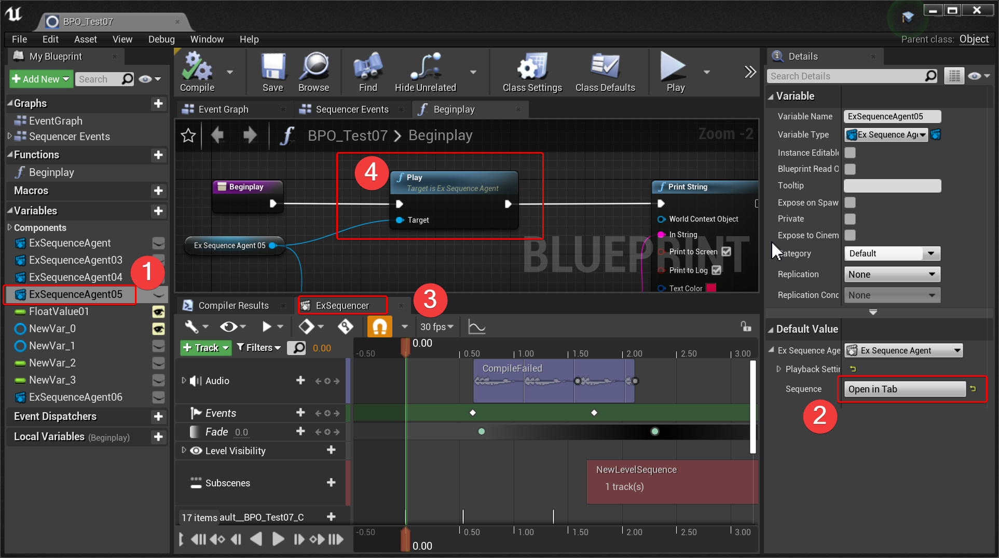

# ExKismet

## ExSequencer

Base on LevelSequence and ActorSequence,  provided this **ExSequencer**: Embed the sequence in any Object Blueprint.

**How to use**:

1. Create a EditInlineNew "ExSequenceAgent" type variable. (Custom Blueprint EditInlineNew variable or C++ version EditInlineNew variable)
2. Click the "OpenInTab" button of the  "ExSequenceAgent" variable.
3. Call the “GetSequencePlayer()" of "ExSequenceAgent" Instance to play the embedded Sequence.

